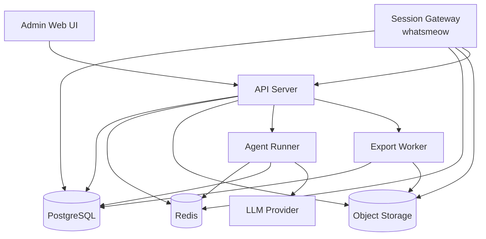

# Design Document

## Overview

`whatsapp-agent-platform` is a self-hosted WhatsApp operations platform centered on `whatsmeow`, the Go multi-device WhatsApp library. The platform is designed to connect one or more WhatsApp accounts, ingest and archive conversation events in near real time, expose a web console for search and review, generate export artifacts for chats and media, and orchestrate AI-assisted replies with explicit guardrails and auditability.

The design separates protocol connectivity from operator-facing product logic. `whatsmeow` remains in a Go service where connection state, event handling, and media retrieval can stay close to the protocol implementation, while agent orchestration is isolated behind a separate service boundary so LLM workflows can evolve without destabilizing the WhatsApp session layer.

## Steering Document Alignment

### Technical Standards (tech.md)

There is currently no `.spec-workflow/steering/tech.md`. This design therefore establishes the initial technical standards for the project:

- Use Go for protocol-facing and high-throughput backend services because `whatsmeow` is native to Go and benefits from a strongly typed, low-overhead runtime.
- Use PostgreSQL as the source of truth for accounts, sessions, chats, messages, exports, and audit records.
- Use Redis for short-lived coordination concerns such as job queues, cache entries, rate controls, and websocket fan-out.
- Keep AI orchestration behind a language-agnostic internal API so the implementation can start in Python without contaminating the core message-ingest path.

### Project Structure (structure.md)

There is currently no `.spec-workflow/steering/structure.md`. This design proposes a modular monorepo structure that cleanly separates runtime responsibilities:

```text
cmd/
  api-server/
  session-gateway/
  export-worker/
internal/
  accounts/
  sessions/
  ingest/
  chats/
  exports/
  agents/
  audit/
  auth/
  storage/
  queue/
web/
  src/
    app/
    pages/
    components/
    features/
deploy/
  docker/
  migrations/
docs/
```

- `cmd/` contains executable entrypoints only.
- `internal/` contains business modules with explicit interfaces.
- `web/` contains the operator console.
- `deploy/` contains container and migration assets.

## Code Reuse Analysis

The current repository does not contain implementation code yet, but it already contains relevant reference projects under `refer/`.

### Existing Components to Leverage

- **`whatsmeow`**: Primary protocol integration reference for session bootstrapping, event handling, message send flows, media handling, and reconnect behavior.
- **`WhatsApp-Chat-Exporter`**: Reference for export shapes, output packaging, and chat rendering patterns for `HTML` and `JSON`.
- **`Baileys`**: Secondary behavioral reference for event taxonomy, reconnect patterns, and production caveats around state persistence and message history synchronization.
- **`whatsapp-web.js` / `wppconnect` / `venom`**: Reference for operator-facing API ergonomics and account lifecycle concepts, not for runtime dependency.

### Integration Points

- **`whatsmeow` client event stream**: Feeds the message ingest pipeline with normalized account, contact, chat, message, receipt, and presence events.
- **PostgreSQL**: Stores normalized product state, powers API reads, and acts as the authoritative audit store.
- **Redis**: Coordinates job queues for exports and agent runs, stores ephemeral cooldown counters, and distributes live UI updates.
- **Object storage**: Stores downloaded media and generated export artifacts. Local filesystem is acceptable for development; MinIO or S3-compatible storage is preferred for deployment.
- **LLM provider API**: Accessed only by the agent service through a provider interface so model choice can change independently of platform logic.

### Reference-Driven Decisions

The following decisions are based on concrete patterns observed in the local reference repositories:

- **`whatsmeow` session bootstrap order**: The reference test client initializes SQL-backed device storage, creates the client, registers an event handler, calls `GetQRChannel(...)` before `Connect()`, and only skips QR flow when `client.Store.ID` already exists. Our session module will preserve this order to avoid invalid QR lifecycle handling.
- **Dedicated credential store adapter**: `whatsmeow` ships with `store/sqlstore`, which confirms that persistent SQL-backed session state is a first-class pattern. We will adopt the same separation, but behind our own credential repository and encryption boundary.
- **Explicit session status endpoints**: The `wppconnect` REST example exposes small, direct endpoints such as connection status checks and send-message operations instead of leaking browser internals to callers. We will keep that operational ergonomics but implement it with service-backed APIs rather than ad hoc Express callbacks.
- **Export format separation**: `WhatsApp-Chat-Exporter` cleanly separates single-file JSON export, per-chat JSON export, and HTML rendering. Our export layer will follow the same idea by isolating renderers per output format instead of one giant conditional code path.
- **Incremental export thinking**: `WhatsApp-Chat-Exporter` includes incremental merge logic, which is a good reminder that exports may evolve over time. MVP will not implement incremental merge yet, but the export artifact model will avoid painting us into a corner.

## Architecture

The architecture uses a modular service split with a Go core and a separate agent runtime:

1. `session-gateway` owns `whatsmeow` device sessions, QR/pairing flows, connection lifecycle, and low-level send/receive operations.
2. `api-server` exposes the administrative REST API, query endpoints, websocket events, permissions, configuration, and audit logging.
3. `export-worker` generates chat export artifacts asynchronously from persisted message history and stored media metadata.
4. `agent-runner` executes rule evaluation, context assembly, LLM calls, reply policy checks, and outbound send requests.
5. `web` provides the operator console for account management, chat review, export management, and agent configuration.

For MVP, `session-gateway`, `api-server`, and `export-worker` can live in a single Go codebase with distinct modules and workers. `agent-runner` can be a Python service because that keeps model integrations simple while protecting the protocol runtime from prompt or SDK churn.

### Modular Design Principles

- **Single File Responsibility**: Each package owns one domain such as `sessions`, `ingest`, `exports`, or `audit`.
- **Component Isolation**: UI pages use feature-scoped components and typed API clients rather than cross-page state hacks.
- **Service Layer Separation**: HTTP handlers, application services, repositories, and protocol adapters remain separate.
- **Utility Modularity**: Export renderers, message normalizers, and rule evaluators are discrete, replaceable modules.



### Runtime Flows

#### 1. Account Connection Flow

1. Operator requests a new account in the UI.
2. `api-server` creates an account record and asks `session-gateway` to initialize a device session.
3. `session-gateway` creates a `whatsmeow` client instance and emits QR or pairing data.
4. UI polls or subscribes to account status updates.
5. Once pairing succeeds, `session-gateway` persists credentials and marks the account as connected.

#### 2. Message Ingest Flow

1. `whatsmeow` emits inbound protocol events.
2. `session-gateway` normalizes the raw events into internal message envelopes.
3. Deduplication logic checks message keys before persistence.
4. Message, chat, contact, and media metadata are written to PostgreSQL.
5. Media download jobs are enqueued if needed.
6. Live updates are published to Redis/websocket consumers for the UI.
7. Agent trigger evaluation is queued asynchronously.

#### 3. Export Flow

1. Operator submits an export job from the UI.
2. `api-server` validates scope and writes an `export_jobs` record.
3. `export-worker` fetches scoped messages and media metadata from PostgreSQL and object storage.
4. The worker renders the export into `JSON`, `Markdown`, or `HTML`.
5. The generated artifact is stored in object storage and linked back to the job record.
6. UI retrieves completion status and exposes the download link until expiry.

#### 4. Agent Reply Flow

1. New inbound message creates a trigger candidate.
2. `agent-runner` loads rule configuration, cooldown counters, and recent chat context.
3. The service builds a structured prompt and calls the configured LLM provider.
4. Post-generation guards validate blacklist, scope, max auto-run count, and sensitive-topic checks.
5. If in suggestion mode, the result is stored as a draft pending operator review.
6. If in auto-send mode and checks pass, `agent-runner` requests `session-gateway` to send the message and records the outcome.

## Components and Interfaces

### Session Gateway

- **Purpose:** Manage `whatsmeow` sessions, QR/pairing flows, reconnect logic, send operations, and raw protocol event intake.
- **Interfaces:**
  - `CreateSession(accountID) -> SessionInit`
  - `GetSessionStatus(accountID) -> SessionStatus`
  - `LogoutSession(accountID) -> void`
  - `SendMessage(accountID, chatJID, outboundPayload) -> SendResult`
  - `HandleWhatsmeowEvent(event) -> NormalizedEvent`
- **Dependencies:** `whatsmeow`, PostgreSQL-backed credential store, Redis pub/sub, object storage client.
- **Reuses:** `whatsmeow` login/session/event patterns from [README](E:/project/whatsapp/refer/whatsmeow/README.md).

### Ingest Service

- **Purpose:** Normalize raw protocol events into product-level entities and persist them idempotently.
- **Interfaces:**
  - `PersistEvent(normalizedEvent) -> PersistResult`
  - `UpsertChat(chatSnapshot) -> ChatID`
  - `UpsertContact(contactSnapshot) -> ContactID`
  - `PersistMessage(messageEnvelope) -> MessageID`
  - `QueueMediaFetch(mediaReference) -> JobID`
- **Dependencies:** repositories for accounts, chats, contacts, messages, media, audit.
- **Reuses:** event coverage patterns inspired by `whatsmeow` and `Baileys`.

### API Server

- **Purpose:** Expose authenticated admin endpoints, query models, configuration APIs, and real-time UI updates.
- **Interfaces:**
  - `POST /api/accounts`
  - `GET /api/accounts`
  - `GET /api/chats`
  - `GET /api/chats/:chatId/messages`
  - `POST /api/exports`
  - `GET /api/exports/:jobId`
  - `POST /api/agents`
  - `POST /api/agent-rules`
  - `POST /api/agent-runs/:runId/send`
- **Dependencies:** application services, auth middleware, websocket broadcaster.
- **Reuses:** operator workflow concepts from browser-based WhatsApp libraries, but no direct code coupling.

### Export Worker

- **Purpose:** Build downloadable artifacts from normalized chat history.
- **Interfaces:**
  - `RunExport(jobID) -> ExportResult`
  - `RenderJSON(messages, metadata) -> Artifact`
  - `RenderMarkdown(messages, metadata) -> Artifact`
  - `RenderHTML(messages, metadata, assets) -> Artifact`
- **Dependencies:** export repository, object storage, templating layer.
- **Reuses:** output and packaging ideas from [WhatsApp-Chat-Exporter README](E:/project/whatsapp/refer/WhatsApp-Chat-Exporter/README.md).

### Agent Runner

- **Purpose:** Evaluate rules, build context, call the LLM provider, and enforce reply guardrails.
- **Interfaces:**
  - `EvaluateTriggers(messageID) -> TriggerDecision`
  - `BuildContext(accountID, chatID, messageID) -> ReplyContext`
  - `GenerateReply(agentID, context) -> ReplyDraft`
  - `ValidateReply(ruleID, draft) -> SafetyDecision`
  - `DispatchReply(runID) -> SendResult`
- **Dependencies:** rule repository, prompt templates, LLM provider adapter, cooldown storage, session send API.
- **Reuses:** none directly from local code; this is a new bounded service.

### Admin Web

- **Purpose:** Give operators one place to connect accounts, inspect chats, export data, and manage agent behavior.
- **Interfaces:**
  - Account connection dashboard
  - Chat list and chat detail pages
  - Export job creation and download pages
  - Agent and rule configuration pages
  - Audit and system health views
- **Dependencies:** REST API client, websocket subscriptions, auth session state.
- **Reuses:** workflow inspiration from existing multi-device admin tools, but implemented in project-native UI components.

### Operator Experience Principles

Because the platform is intended for routine use by novice employees as well as experienced operators, the UI must optimize for clarity over cleverness:

- **Guided primary flows:** Each page should have one obvious primary action, supported by inline helper text and calm empty states.
- **Plain-language labeling:** Avoid protocol jargon like `JID`, `ephemeral`, or `pairing nonce` in the main UI unless hidden behind advanced detail views.
- **Safe defaults:** Agent rules default to suggestion mode, export forms default to conservative scopes, and destructive actions require explicit confirmation.
- **Visible system state:** Account connection, export progress, and agent run outcomes must be visible at a glance using consistent status badges and timeline cues.
- **Progressive disclosure:** Advanced controls belong in drawers, secondary panels, or expandable sections instead of the default viewport.
- **Operator reassurance:** Every important action should produce immediate feedback so a new employee does not wonder whether the system accepted the action.

### Frontend Visual Direction

The admin console should feel orderly, trustworthy, and approachable rather than flashy or developer-centric:

- Use a bright, professional workspace with strong typography hierarchy and restrained status color usage.
- Favor generous row spacing, card grouping, and obvious section titles so scanning the page is effortless.
- Keep destructive actions visually separated from normal actions.
- Use dense information layouts only where the user already has context, such as a chat transcript or export history table.
- Make the chat workspace especially legible, with clear sender contrast, timestamp rhythm, media preview affordances, and sticky contextual headers.

## Data Models

### Account

```text
Account
- id: uuid
- display_name: string
- phone_number: string|null
- status: enum(pending, pairing, connected, reconnecting, disconnected, logged_out, failed)
- platform_label: string|null
- last_seen_at: timestamptz|null
- created_at: timestamptz
- updated_at: timestamptz
```

### SessionCredential

```text
SessionCredential
- account_id: uuid
- credential_blob: encrypted json/blob
- noise_keys_version: integer
- device_id: string|null
- last_synced_at: timestamptz
```

### Chat

```text
Chat
- id: uuid
- account_id: uuid
- wa_chat_jid: string
- chat_type: enum(direct, group, broadcast, status)
- title: string|null
- participant_count: integer|null
- archived: boolean
- muted_until: timestamptz|null
- last_message_id: uuid|null
- last_message_at: timestamptz|null
- created_at: timestamptz
- updated_at: timestamptz
```

### Contact

```text
Contact
- id: uuid
- account_id: uuid
- wa_jid: string
- display_name: string|null
- push_name: string|null
- phone_number: string|null
- profile_photo_url: string|null
- is_business: boolean
- created_at: timestamptz
- updated_at: timestamptz
```

### Message

```text
Message
- id: uuid
- account_id: uuid
- chat_id: uuid
- wa_message_id: string
- sender_jid: string
- from_me: boolean
- message_type: enum(text, image, video, audio, document, sticker, reaction, system, location, contact, poll, unknown)
- text_content: text|null
- reply_to_message_id: uuid|null
- sent_at: timestamptz
- delivered_at: timestamptz|null
- read_at: timestamptz|null
- raw_payload: jsonb
- created_at: timestamptz
```

### MediaAsset

```text
MediaAsset
- id: uuid
- message_id: uuid
- media_type: enum(image, video, audio, document, sticker, thumbnail, other)
- mime_type: string|null
- file_name: string|null
- byte_size: bigint|null
- sha256: string|null
- storage_key: string|null
- download_status: enum(pending, ready, failed, expired)
- created_at: timestamptz
```

### ExportJob

```text
ExportJob
- id: uuid
- account_id: uuid
- requested_by: uuid
- scope_type: enum(chat, multiple_chats, account)
- format: enum(json, markdown, html)
- include_media: boolean
- status: enum(queued, running, completed, failed, expired)
- progress_percent: integer
- artifact_key: string|null
- error_message: text|null
- expires_at: timestamptz|null
- created_at: timestamptz
- completed_at: timestamptz|null
```

### AgentRule

```text
AgentRule
- id: uuid
- account_id: uuid
- name: string
- enabled: boolean
- scope_filter: jsonb
- trigger_filter: jsonb
- reply_mode: enum(suggest, auto_send)
- cooldown_seconds: integer
- max_auto_replies_per_thread: integer
- blacklist_filter: jsonb
- prompt_template: text
- knowledge_binding: jsonb|null
- created_at: timestamptz
- updated_at: timestamptz
```

### AgentRun

```text
AgentRun
- id: uuid
- rule_id: uuid
- account_id: uuid
- chat_id: uuid
- trigger_message_id: uuid
- status: enum(queued, generating, blocked, ready_for_review, sent, failed)
- input_context: jsonb
- output_draft: text|null
- block_reason: text|null
- sent_message_id: uuid|null
- created_at: timestamptz
- completed_at: timestamptz|null
```

### AuditLog

```text
AuditLog
- id: uuid
- actor_type: enum(user, system, agent)
- actor_id: uuid|string|null
- action: string
- target_type: string
- target_id: string
- outcome: enum(success, denied, blocked, failed)
- detail: jsonb
- created_at: timestamptz
```

## API Surface

The MVP API should remain intentionally narrow and operator-focused.

### Account Management

- `POST /api/accounts`
  - Create a new managed account shell.
- `POST /api/accounts/:accountId/pair`
  - Request QR or pairing initialization.
- `GET /api/accounts/:accountId/status`
  - Read current session state and recent errors.
- `POST /api/accounts/:accountId/logout`
  - Revoke the current session.

### Chat Review

- `GET /api/chats`
  - Filter by account, chat type, keyword, and updated-at range.
- `GET /api/chats/:chatId/messages`
  - Paginated history with optional before/after cursors.
- `GET /api/chats/:chatId/media`
  - Media references associated with the chat.

### Exports

- `POST /api/exports`
  - Submit export request.
- `GET /api/exports`
  - List export jobs.
- `GET /api/exports/:jobId`
  - Read job state and artifact availability.
- `DELETE /api/exports/:jobId/artifact`
  - Remove artifact while retaining audit record.

### Agents

- `GET /api/agents/rules`
  - List configured rules.
- `POST /api/agents/rules`
  - Create or update a rule.
- `POST /api/agent-runs/:runId/approve-send`
  - Approve a suggested reply for dispatch.
- `POST /api/agent-runs/:runId/reject`
  - Reject a draft.
- `GET /api/agent-runs`
  - List or filter agent execution history.

### Audit and Health

- `GET /api/audit`
  - Query audit records by action, target, actor, or outcome.
- `GET /api/system/health`
  - Aggregate session, queue, export, and agent pipeline health.

## Persistence and State Management

### Credential Storage

- `whatsmeow` credentials and device key material must be stored encrypted at rest.
- Credential persistence must be atomic to avoid corrupting active sessions when keys rotate during message processing.
- A dedicated credential repository should abstract serialization and encryption details from the session module.

### Deduplication Strategy

- Use a unique constraint on `(account_id, wa_message_id)` for primary message deduplication.
- Use secondary uniqueness rules where protocol updates are modeled separately, such as reactions or receipts.
- Persist raw payloads in `jsonb` for debugging and future parser upgrades, but keep query-facing columns normalized.

### Media Strategy

- Persist media metadata immediately during ingest even if the binary file is downloaded later.
- Download media asynchronously to avoid blocking the event loop.
- Store binaries outside PostgreSQL and reference them via `storage_key`.
- Treat expired or missing media as a recoverable export condition, not a fatal export failure unless the export explicitly requires hard inclusion.

## Security and Guardrails

### Authentication and Authorization

- Require authenticated operator sessions for all admin APIs.
- Introduce role scopes early: `admin`, `operator`, and `viewer`.
- Scope account, export, and agent access by tenant or explicit ownership if multi-account support grows later.

### Agent Guardrails

- Every auto-send rule must define cooldowns and per-thread message caps.
- Sensitive-topic detection should block categories such as payments, legal threats, compliance issues, or account recovery unless explicitly approved.
- Suggestion mode should be the default rule mode.
- Auto-send should be opt-in and visibly labeled in the UI.

### Abuse Prevention

- Do not include bulk broadcast or campaign messaging in the MVP surface.
- Add operator-visible warnings for reconnect storms, send failures, or rules that trigger too often.
- Preserve audit logs for blocked and denied actions, not just successful ones.

## Error Handling

### Error Scenarios

1. **Session credential corruption**
   - **Handling:** Mark account as failed, stop automatic reconnect attempts, emit a visible remediation state, and require operator re-pairing.
   - **User Impact:** The account shows as unavailable with a human-readable recovery action.

2. **Protocol disconnect or forced logout**
   - **Handling:** Distinguish transient disconnects from logged-out states, retry only transient failures, and persist the disconnect reason.
   - **User Impact:** Operators see whether the account is reconnecting or needs manual intervention.

3. **Duplicate or out-of-order message events**
   - **Handling:** Apply unique constraints, idempotent upserts, and reconciliation logic for receipts or reactions arriving after the base message.
   - **User Impact:** Chat history remains consistent without duplicate lines.

4. **Media fetch failure**
   - **Handling:** Mark asset download as failed with a retry count and preserve the original metadata reference.
   - **User Impact:** The chat still renders, but the media entry shows as unavailable or pending retry.

5. **Export worker crash or render error**
   - **Handling:** Mark the export job failed, persist the error class and message, and allow retry from the job detail screen.
   - **User Impact:** The operator sees a failed export state rather than a forever-running job.

6. **LLM timeout or invalid output**
   - **Handling:** Mark the run failed or blocked, never auto-send partial output, and preserve the execution trace for review.
   - **User Impact:** The operator sees that the draft could not be generated and why.

7. **Send rejected by safety policy**
   - **Handling:** Keep the generated content, record the violated policy, and require manual override only through an explicit review path.
   - **User Impact:** The operator sees the blocked reason and can revise rules instead of guessing.

## Observability

- Emit structured logs with `account_id`, `chat_id`, `message_id`, and `job_id` correlation fields.
- Track core metrics:
  - active sessions
  - reconnect attempts
  - ingest latency
  - message persistence failures
  - export queue depth
  - agent run latency
  - auto-send block counts
- Provide an internal admin status summary endpoint so the UI can surface queue lag, failed exports, and broken sessions.

## Testing Strategy

### Unit Testing

- Test message normalization against representative `whatsmeow` event payloads.
- Test repository deduplication behavior and unique-constraint handling.
- Test export renderers for stable output formatting and media reference handling.
- Test rule evaluation, cooldown counters, and safety blockers deterministically.

### Integration Testing

- Use a PostgreSQL test database to verify account, chat, message, media, export, and audit flows.
- Exercise session state transitions by mocking `whatsmeow` connection and disconnect events.
- Verify agent-runner to session-gateway integration for suggestion and send workflows.
- Verify export jobs from queued creation through artifact persistence.

### End-to-End Testing

- Account pairing flow from admin UI to connected state.
- Real-time message ingest reflected in chat detail view.
- Export submission, progress update, and artifact download.
- Agent suggestion review and manual approval send.
- Auto-send blocked by safety policy with visible audit output.

## Open Design Decisions

These choices can remain deferred until implementation planning, but the current direction is:

- **UI framework:** React with Vite for fast iteration and typed API clients.
- **Go HTTP stack:** `chi` or `gin` are both acceptable; prefer the one that keeps middleware and validation simple.
- **Queue mechanism:** Start with Redis-backed jobs for MVP; migrate to a stronger broker only if throughput or durability requires it.
- **Search:** PostgreSQL `tsvector` is enough for MVP keyword search; dedicated search infrastructure is unnecessary this early.
